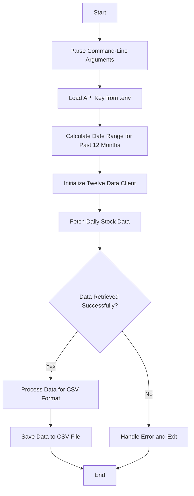

# Stock Data Retrieval Plan

This document outlines the plan for creating a Python script to retrieve 12 months of daily stock data using the Twelve Data API.

## Requirements

- Retrieve 12 months of daily closing data for a stock from the Twelve Data API
- Create the script in the `/quant` directory
- Use the API key stored in the `.env` file in the `/quant` directory
- Accept the stock symbol from the command line (with MSFT as the default example)
- Save the output as a CSV file containing all OHLCV (Open, High, Low, Close, Volume) data

## Implementation Plan

### 1. High-Level Components



### 2. Detailed Component Breakdown

#### a. Environment Setup

- Import necessary libraries (twelvedata, datetime, argparse, os, etc.)
- Load the API key from `.env` file using either the `dotenv` library or `os.environ`

#### b. Command-Line Argument Parsing

- Set up argument parser to accept the stock symbol
- Include optional parameters like output filename

#### c. Date Calculation

- Calculate the date range for the past 12 months from the current date

#### d. Data Retrieval

- Initialize the `TDClient` with the API key
- Configure the time series request with:
  - Symbol from command line
  - Interval of "1day"
  - Start date (12 months ago)
  - End date (today)
- Convert the API response to a pandas DataFrame

#### e. Data Processing and Export

- Save the data to a CSV file with all OHLCV columns
- Include proper error handling

### 3. Python Script Structure

```python
#!/usr/bin/env python3
"""
stock_data.py - Retrieves daily OHLCV data for a stock over the past 12 months.

Usage:
    python stock_data.py SYMBOL [--output OUTPUT_FILE]

Example:
    python stock_data.py MSFT --output msft_data.csv
"""

import os
import argparse
import datetime
import pandas as pd
from twelvedata import TDClient
from dotenv import load_dotenv

def parse_arguments():
    """Parse command-line arguments."""
    parser = argparse.ArgumentParser(description='Pull daily stock data for the last 12 months.')
    parser.add_argument('symbol', type=str, help='Stock symbol to retrieve data for (e.g., MSFT)')
    parser.add_argument('--output', type=str, help='Output CSV filename (default: <symbol>_daily_data.csv)')
    return parser.parse_args()

def get_date_range():
    """Calculate the date range for the past 12 months."""
    end_date = datetime.datetime.now().date()
    start_date = end_date - datetime.timedelta(days=365)  # Approximately 12 months
    return start_date.strftime('%Y-%m-%d'), end_date.strftime('%Y-%m-%d')

def fetch_stock_data(api_key, symbol, start_date, end_date):
    """Fetch daily stock data from Twelve Data API."""
    # Initialize client
    td = TDClient(apikey=api_key)

    # Create time series query
    ts = td.time_series(
        symbol=symbol,
        interval="1day",
        start_date=start_date,
        end_date=end_date
    )

    # Return data as pandas DataFrame
    return ts.as_pandas()

def save_to_csv(dataframe, filename):
    """Save the stock data to a CSV file."""
    dataframe.to_csv(filename)
    print(f"Data saved to {filename}")

def main():
    """Main function to orchestrate the stock data retrieval."""
    # Parse arguments
    args = parse_arguments()
    symbol = args.symbol.upper()
    output_file = args.output if args.output else f"{symbol}_daily_data.csv"

    # Load API key from .env
    load_dotenv()
    api_key = os.getenv("TWELVEKEY")

    if not api_key:
        print("ERROR: API key not found in .env file")
        return 1

    try:
        # Get date range
        start_date, end_date = get_date_range()
        print(f"Fetching daily data for {symbol} from {start_date} to {end_date}")

        # Fetch data
        data = fetch_stock_data(api_key, symbol, start_date, end_date)

        # Save to CSV
        save_to_csv(data, output_file)

        return 0

    except Exception as e:
        print(f"ERROR: {e}")
        return 1

if __name__ == "__main__":
    exit(main())
```

### 4. Key Features and Benefits

- **Flexible**: Accepts any stock symbol from the command line
- **Complete Data**: Retrieves all OHLCV data, not just closing prices
- **Error Handling**: Includes proper error handling and user feedback
- **Simple Usage**: Easy to use with minimal parameters required
- **Configurable Output**: Allows specifying a custom output filename

## Next Steps

1. Implement the Python script in the `/quant` directory
2. Test the script with various stock symbols
3. Consider future enhancements:
   - Add visualization capabilities
   - Support for multiple stock symbols
   - Add data analysis features
