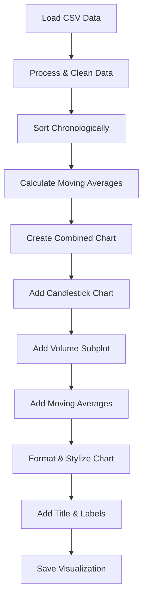

# Stock Data Visualization Plan

This document outlines the plan for creating visualizations from the Microsoft stock data retrieved by the `stock_data.py` script and stored in `data/msft_data.csv`.

## 1. Data Analysis

The dataset in `quant/data/msft_data.csv` contains:

- Daily OHLCV (Open, High, Low, Close, Volume) data for Microsoft (MSFT) stock
- Approximately one year of trading data (April 2024 to April 2025)
- Data in reverse chronological order (newest first)
- Around 250 trading days worth of data

## 2. Visualization Goals

Create a comprehensive candlestick chart visualization that includes:

1. **Price Movement**: OHLC price data displayed as candlesticks
2. **Volume Analysis**: Trading volume displayed as a bar chart below the price chart
3. **Trend Analysis**: Moving averages (20-day and 50-day) overlaid on the price chart

## 3. Implementation Plan



## 4. Technical Requirements

To create this visualization, we'll need the following libraries:

1. **Data Processing Libraries**:

   - pandas: For data manipulation and analysis
   - numpy: For numerical operations

2. **Visualization Libraries**:
   - matplotlib: For basic plotting capabilities
   - mplfinance: Specialized library for financial charts (requires installation)

## 5. Implementation Details

### 5.1 Data Preparation

```python
# Read and prepare the data
def prepare_data(csv_file):
    # Read the CSV file
    df = pd.read_csv(csv_file)

    # Convert datetime to proper format and set as index
    df['datetime'] = pd.to_datetime(df['datetime'])
    df.set_index('datetime', inplace=True)

    # Sort data chronologically (oldest to newest)
    df.sort_index(inplace=True)

    # Calculate moving averages
    df['MA20'] = df['close'].rolling(window=20).mean()
    df['MA50'] = df['close'].rolling(window=50).mean()

    return df
```

### 5.2 Creating the Visualization

```python
# Create the visualization
def create_visualization(df, output_file):
    # Set up style for the chart
    mc = mpf.make_marketcolors(
        up='green', down='red',
        edge='inherit',
        wick='black',
        volume='inherit'
    )

    s = mpf.make_mpf_style(
        marketcolors=mc,
        gridstyle='--',
        y_on_right=False
    )

    # Create additional plots for moving averages
    additional_plots = [
        mpf.make_addplot(df['MA20'], color='blue', width=1),
        mpf.make_addplot(df['MA50'], color='red', width=1)
    ]

    # Create the plot with volume and moving averages
    fig, axes = mpf.plot(
        df,
        type='candle',
        style=s,
        title='MSFT Stock Price (with Volume and Moving Averages)',
        ylabel='Price ($)',
        volume=True,
        figsize=(12, 8),
        addplot=additional_plots,
        returnfig=True
    )

    # Save the figure
    fig.savefig(output_file)

    return fig
```

### 5.3 Main Function

```python
def main():
    # Define input and output files
    input_file = 'quant/data/msft_data.csv'
    output_file = 'quant/data/msft_visualization.png'

    # Prepare the data
    df = prepare_data(input_file)

    # Create the visualization
    fig = create_visualization(df, output_file)

    print(f"Visualization saved to {output_file}")

    return 0

if __name__ == "__main__":
    exit(main())
```

## 6. Script Structure

The complete script `visualize_stock.py` will have the following structure:

1. **Imports**:

   - Import necessary libraries (pandas, numpy, matplotlib, mplfinance)

2. **Functions**:

   - `prepare_data()`: Load and prepare the stock data
   - `create_visualization()`: Create and style the visualization
   - `main()`: Orchestrate the entire process

3. **Command-Line Support**:
   - Add argument parsing for input/output file customization

## 7. Planned Features

The visualization will include:

1. **Candlestick Chart**:

   - Green candles for up days (close > open)
   - Red candles for down days (close < open)
   - Wicks showing the high and low prices

2. **Volume Bars**:

   - Volume displayed as bars below the price chart
   - Color-coded to match the price movement

3. **Moving Averages**:

   - 20-day simple moving average (short-term trend)
   - 50-day simple moving average (medium-term trend)

4. **Aesthetics and Readability**:
   - Grid lines for easier data reading
   - Proper date formatting on the x-axis
   - Clear title and axis labels

## 8. Next Steps

1. Implement the `visualize_stock.py` script in the `/quant` directory
2. Install any missing dependencies (particularly mplfinance)
3. Run the script to generate the visualization
4. Review the output and make any necessary adjustments to improve readability
5. Consider potential enhancements for future versions

## 9. Future Enhancements

Consider these potential enhancements for future iterations:

1. **Additional Technical Indicators**:

   - Bollinger Bands
   - RSI (Relative Strength Index)
   - MACD (Moving Average Convergence Divergence)

2. **Interactive Features**:

   - Interactive HTML output with tools like Plotly
   - Zoom and pan capabilities
   - Tooltip information on hover

3. **Multiple Visualization Types**:
   - Line charts
   - Bar charts
   - Area charts
