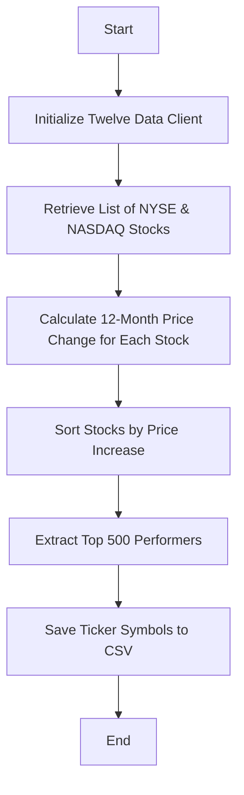
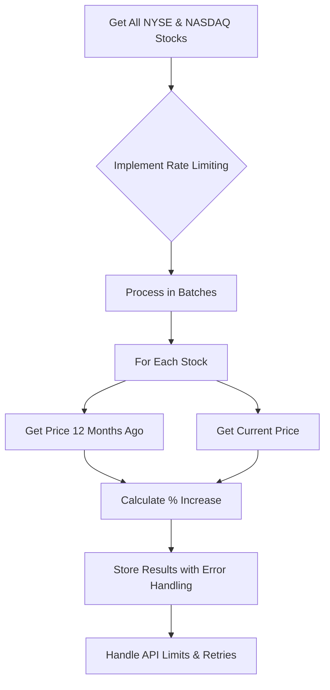

# Top 500 Stocks Data Retrieval Plan (By 12-Month Price Increase)

This document outlines the plan for creating a Python script to retrieve the top 500 stocks from NYSE and NASDAQ exchanges, ranked by their price increase over the last 12 months.

## Requirements & Challenges

- Retrieve stocks from both NYSE and NASDAQ exchanges
- Calculate 12-month price increase for each stock
- Rank and select the top 500 performers
- Save only the ticker symbols to a CSV file
- Work within Twelve Data API limits (8 calls/minute, 800 calls/day on free tier)

## Implementation Plan

### 1. High-Level Components



### 2. Detailed Component Breakdown

#### a. Data Retrieval Strategy



#### b. Specific Implementation Steps

1. **Retrieve Stock List**:

   - Use `TDClient.get_stocks_list()` to get NYSE and NASDAQ stocks
   - Filter by exchange if needed

2. **Price Calculation Strategy**:

   - To avoid making 2 API calls per stock (which would quickly hit limits), we'll:
     - Get 1-day time series data with 2 data points: today and 12 months ago
     - Calculate percentage increase from these points

3. **Handling API Limitations**:

   - Implement rate limiting (max 8 calls/minute)
   - Store intermediate results to file so we can resume if needed
   - Add exponential backoff for retry logic

4. **Performance Sorting & Selection**:

   - Sort all stocks by percentage increase (descending)
   - Select top 500 performers
   - Extract just the ticker symbols

5. **CSV Output Format**:
   - Simple one-column CSV with ticker symbols only
   - Include a header row for clarity

### 3. Python Implementation Structure

```python
#!/usr/bin/env python3
"""
top_performers.py - Retrieves the top 500 stocks from NYSE and NASDAQ by 12-month price increase.

Usage:
    python quant/top_performers.py [--output OUTPUT_FILE]

Example:
    python quant/top_performers.py --output quant/data/top500_performers.csv
"""

import os
import time
import argparse
import datetime
import pandas as pd
from twelvedata import TDClient
from dotenv import load_dotenv

def parse_arguments():
    """Parse command-line arguments."""
    parser = argparse.ArgumentParser(description='Get top 500 NYSE & NASDAQ stocks by 12-month price increase.')
    parser.add_argument('--output', type=str, default='quant/data/top500_performers.csv',
                        help='Output CSV filename (default: quant/data/top500_performers.csv)')
    parser.add_argument('--cache', action='store_true',
                        help='Use cached stock list if available (to avoid API calls)')
    return parser.parse_args()

def get_all_exchange_stocks(td_client, exchanges=None):
    """Get list of all stocks from specified exchanges."""
    if exchanges is None:
        exchanges = ['NYSE', 'NASDAQ']

    all_stocks = []
    for exchange in exchanges:
        stocks = td_client.get_stocks_list(exchange=exchange)
        all_stocks.extend(stocks)

    return all_stocks

def calculate_price_increase(td_client, symbol, lookback_days=365):
    """Calculate price increase percentage over specified period."""
    # Implementation details...

def process_stocks_with_rate_limiting(td_client, stock_list, cache_file=None):
    """Process stocks with rate limiting to respect API limits."""
    # Implementation details...

def main():
    """Main function to orchestrate the top performers retrieval."""
    # Parse arguments
    args = parse_arguments()

    # Load API key from .env
    script_dir = os.path.dirname(os.path.abspath(__file__))
    dotenv_path = os.path.join(script_dir, '.env')
    load_dotenv(dotenv_path=dotenv_path)
    api_key = os.getenv("TWELVEKEY")

    if not api_key:
        print(f"ERROR: API key 'TWELVEKEY' not found in {dotenv_path}")
        return 1

    try:
        # Initialize client
        td = TDClient(apikey=api_key)

        # Get stocks from NYSE and NASDAQ
        # Rest of implementation...

        # Save top 500 to CSV
        # Final CSV output...

        return 0

    except Exception as e:
        print(f"ERROR: An error occurred: {e}")
        return 1

if __name__ == "__main__":
    exit(main())
```

### 4. Key Implementation Challenges & Solutions

1. **API Rate Limits**

   - Problem: Free tier limited to 8 calls/minute and 800 calls/day
   - Solution: Implement rate limiting with time.sleep() and track call count

2. **Large Data Volume**

   - Problem: There are thousands of stocks across NYSE and NASDAQ
   - Solution: Save intermediate results in case process needs to be resumed

3. **Error Handling**

   - Problem: API calls may fail for various reasons
   - Solution: Implement retry logic with exponential backoff

4. **Performance**
   - Problem: Processing thousands of stocks is time-intensive
   - Solution: Implement progress tracking and optional caching

### 5. Additional Considerations

- **Handling Delisted/Invalid Stocks**: Some stocks may have incomplete data or be delisted
- **Data Normalization**: Adjusting for stock splits and dividends (handled by Twelve Data)
- **Alternative Approach**: If direct API becomes too limited, consider if Twelve Data offers any bulk/screening endpoints

## Next Steps

1. Implement the Python script in the `/quant` directory
2. Test with a small subset of stocks first
3. Run the full script to generate the top 500 list
4. Consider future enhancements:
   - Add more data points to the CSV (price, market cap, etc.)
   - Create a visualization of the top performers
   - Set up automated periodic updates
