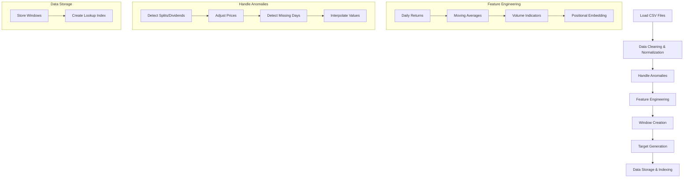

# Data Preparation Plan for Stock Increase Prediction Model

This document outlines the detailed plan for preparing data for the Temporal Fusion Transformer (TFT) model that predicts stock price increases.

## Data Understanding

From examination of the files:

1. We have hundreds of stock CSV files in `quant/data/historical/`
2. Each file contains OHLCV data (datetime, open, high, low, close, volume)
3. The data appears to be daily price data sorted in reverse chronological order
4. The existing codebase already has strong tools for downloading and working with stock data

## Requirements and Constraints

1. **Scalability**: The pipeline needs to handle hundreds of stocks with years of historical data (potentially millions of data points)
2. **Data Quality**: We need to detect and handle stock splits, dividends, and missing trading days
3. **Feature Set**: Daily returns, moving averages, volume indicators, and positional embeddings
4. **Target Variable**: Binary classification (price increase after 7 days)
5. **Static Features**: Only `stock_id` as a categorical embedding

## Data Preparation Pipeline Architecture



## Detailed Pipeline Components

### 1. Data Loading & Initial Processing

- Load stock data from CSV files
- Add `stock_id` column based on filename
- Convert datetime to proper format
- Sort chronologically (important for time series)
- Combine all stocks into a single dataset

### 2. Anomaly Detection & Handling

- **Stock Splits/Dividends**: 
  - Detect unusual price jumps (e.g., >20% change without volume support)
  - Apply appropriate price adjustments 
- **Missing Trading Days**:
  - Identify business days with missing data (excluding weekends/holidays)
  - Use appropriate interpolation method based on gap size

### 3. Feature Engineering

- **Daily Returns**: Calculate percentage change from previous close
- **Moving Averages**: Calculate 5-day and 20-day moving averages
- **Volume Indicators**: Calculate average volume over past week
- **Positional Embedding**: Add column representing relative day position (0-59)

### 4. Window Creation & Target Generation

- For each prediction date, create a window of previous 60 calendar days
- Calculate target: 1 if price increases after 7 calendar days, 0 otherwise
- Ensure each window has complete data (no NaNs)

### 5. Data Storage & Indexing

- Store processed windows efficiently (Parquet format)
- Create index for fast retrieval by stock_id and date
- Enable efficient batch loading for model training

## Technical Implementation Design

Here's a modular code structure to implement this pipeline:

```
quant/
├── data_preparation/
│   ├── __init__.py
│   ├── data_loader.py         # Load stock CSV files
│   ├── anomaly_handler.py     # Detect/handle splits and missing days
│   ├── feature_engineer.py    # Create model features
│   ├── window_creator.py      # Create labeled windows
│   ├── data_pipeline.py       # Orchestrates the entire pipeline
│   └── data_utils.py          # Utility functions
```

Key implementation considerations:

1. **Memory Efficiency**: Process stocks in batches if dataset is too large
2. **Parallelization**: Use parallel processing where possible (e.g., loading multiple stocks)
3. **Error Handling**: Robust handling of data anomalies and missing values
4. **Performance Monitoring**: Log processing times for optimization

## Example Usage

Here's how the pipeline would be used:

```python
# Main pipeline execution
python quant/data_preparation/data_pipeline.py \
    --data-dir quant/data/historical/ \
    --output-dir quant/data/processed/ \
    --window-size 60 \
    --prediction-days 7
```

## Additional Considerations

1. **Data Validation**: Add checks to ensure data quality at each pipeline stage
2. **Caching Strategy**: Cache intermediate results for faster reprocessing
3. **Feature Normalization**: Consider normalization strategies for numeric features
4. **Stock Universe Selection**: Add ability to filter stocks based on criteria (liquidity, market cap, etc.)

## Lookup Function Design

For model inference, we'll implement a fast lookup function to retrieve the 60-day window for any stock/date combination:

```python
def get_window(stock_id, prediction_date):
    """Get the 60-day window for a specific stock and prediction date.
    
    Args:
        stock_id (str): Stock symbol
        prediction_date (datetime): Date for which to make prediction
        
    Returns:
        dict: Window data and metadata
    """
    # Implementation will use efficient indexing
```

This lookup function will be crucial for the model interface requirements.